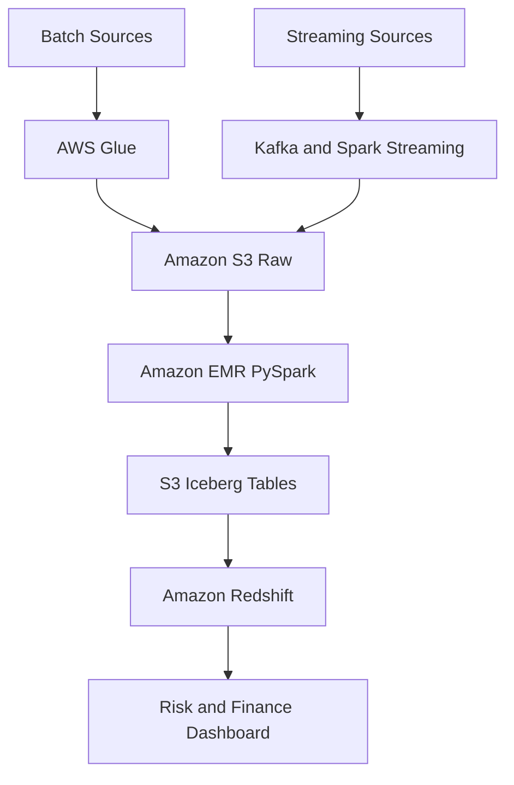

# Capital Markets Trade and Risk Data Platform

**Status:** In Development

## Project Overview

This independent portfolio project simulates an enterprise capital-markets data platform using synthetic financial data and publicly available market-price data.

The platform processes trade executions, positions, accounts, securities, counterparties and market prices through batch and streaming pipelines. It produces analytics-ready datasets for financial reporting, profit and loss calculations, portfolio exposure and risk analysis.

## Objectives

- Process more than 10 million financial records
- Build batch and real-time streaming pipelines
- Store raw, processed and curated data in Amazon S3
- Transform large datasets using PySpark and Spark SQL
- Implement Apache Iceberg incremental processing
- Schedule and monitor pipelines using Apache Airflow
- Build automated data-quality and reconciliation checks
- Publish dimensional models for reporting
- Implement monitoring, security, Terraform and CI/CD
- Measure Spark and pipeline performance improvements

## Architecture

## Planned Data Volume

| Dataset | Approximate Records |
|---|---:|
| Trade executions | 10,000,000 |
| Market prices | 3,000,000 |
| Position snapshots | 1,000,000 |
| Customer accounts | 100,000 |
| Securities | 20,000 |
| Counterparties | 5,000 |

## Business Outputs

- Daily portfolio positions
- Realized and unrealized profit and loss
- Portfolio market value
- Exposure by security and sector
- Counterparty exposure
- Concentration risk
- Price volatility
- Daily trading summaries

## Data Engineering Scenarios

The project will demonstrate:

- Duplicate-trade handling
- Missing and invalid record detection
- Late-arriving data
- Schema evolution
- Source-to-target reconciliation
- Incremental processing
- Partition pruning
- Spark performance optimization
- Pipeline retries and controlled reruns
- Monitoring and alerting

## Technology Stack

- Python and SQL
- PySpark and Spark SQL
- Apache Kafka
- Apache Airflow
- Docker
- Amazon S3
- AWS Glue
- Amazon EMR Serverless
- Apache Iceberg
- Amazon Redshift Serverless
- Amazon CloudWatch
- Terraform
- GitHub Actions
- Power BI or Amazon QuickSight

## Disclaimer

This is an independent educational portfolio project. It uses synthetic data and public market information. It does not contain confidential information or represent an internal system belonging to TD Securities or another financial institution.