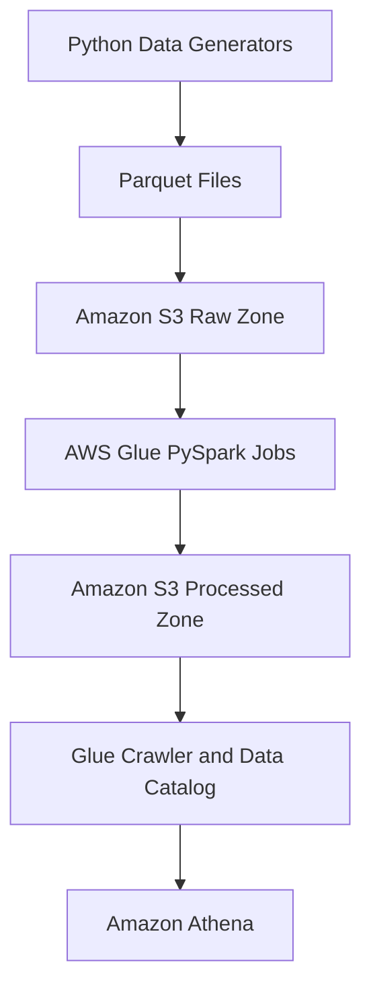
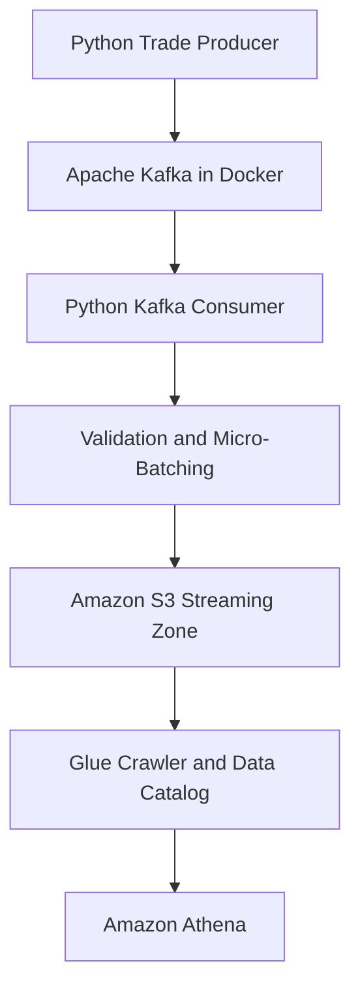
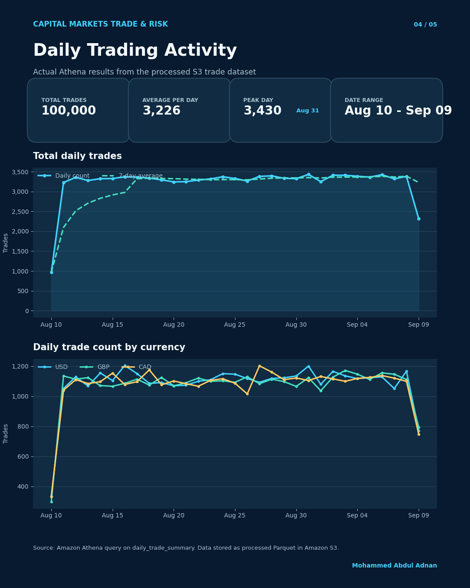

# Capital Markets Trade and Risk Data Platform

**Status:** Completed

## Project Overview

This portfolio project demonstrates an end-to-end capital-markets data platform using synthetic financial data.

It processes accounts, counterparties, securities, trades, positions, and market prices through batch and streaming pipelines. The processed data supports portfolio valuation, profit-and-loss analysis, exposure analysis, and risk reporting.

## Architecture

### Batch Pipeline



### Streaming Pipeline



## What Was Implemented

### Data Generation

Synthetic datasets were generated for:

- Customer accounts
- Counterparties
- Securities
- Trade executions
- Positions
- Market prices

### Batch Processing

Three AWS Glue PySpark jobs were created:

- `trade-risk-process-trades`
- `trade-risk-process-positions`
- `trade-risk-process-market-prices`

These jobs:

- Read raw Parquet files from Amazon S3
- Validate required fields
- Remove duplicate or invalid records
- Enrich and transform the data
- Partition the output by date
- Write processed Parquet data back to Amazon S3

### Workflow Orchestration

An AWS Glue workflow named `trade-risk-batch-workflow` runs the three processing jobs.

After all three jobs succeed, the conditional trigger starts `trade-risk-processed-crawler`. The crawler updates the AWS Glue Data Catalog so the latest processed data can be queried in Athena.

### Streaming Ingestion

The streaming pipeline uses:

- A Python producer to generate synthetic trade events
- Apache Kafka running locally through Docker
- A Python consumer to validate trade events
- Micro-batches of validated JSON records
- Amazon S3 as the streaming-data destination

The streaming crawler registers the S3 data in the Glue Data Catalog, making it queryable through Athena.

## Analytics Created

Athena tables and reusable views were created for:

- Enriched trades
- Fully enriched trades
- Position valuation
- Daily trade summaries
- Account portfolio summaries
- Account risk summaries
- Market-price analysis
- Streaming trade validation

Example streaming validation results included:

- Total trade count
- Distinct account count
- BUY trade count
- SELL trade count

## Technology Stack

- Python
- PySpark
- SQL
- Apache Kafka
- Docker
- Amazon S3
- AWS Glue ETL
- AWS Glue Workflows
- AWS Glue Crawlers
- AWS Glue Data Catalog
- Amazon Athena
- Parquet
- JSON
- Git and GitHub

## Project Structure

```text
capital-markets-trade-risk-platform/
├── config/
│   └── data_generation.yml
├── src/
│   ├── generators/
│   │   ├── generate_accounts.py
│   │   ├── generate_counterparties.py
│   │   ├── generate_market_prices.py
│   │   ├── generate_positions.py
│   │   ├── generate_securities.py
│   │   ├── generate_trades.py
│   │   └── kafka_trade_producer.py
│   ├── ingestion/
│   │   ├── kafka_trade_consumer.py
│   │   └── upload_to_s3.py
│   └── jobs/
│       └── batch/
│           ├── process_market_prices.py
│           ├── process_positions.py
│           └── process_trades.py
├── docker-compose.yml
├── requirements.txt
├── .gitignore
└── README.md
```

## Key Learning Outcomes

This project demonstrates how to:

- Build batch and streaming data pipelines
- Store raw and processed data in Amazon S3
- Transform financial data with PySpark
- Validate missing, duplicate, and invalid records
- Partition data for efficient processing
- Coordinate parallel Glue jobs using workflows and triggers
- Automatically update metadata using Glue crawlers
- Query S3 data using Athena
- Handle job failures such as access-denied and existing-output-path errors
- Protect secrets and generated files using `.gitignore`
## Project Results

### Daily Trading Activity

This chart shows the daily number of processed trades and the BUY/SELL distribution.



### Daily Trade Value Trends

This chart shows the daily trade value trend by currency. The currency values are shown separately because no foreign-exchange conversion was applied.


## Disclaimer

This is an independent educational portfolio project. It uses synthetic data and does not contain confidential information or represent an internal system belonging to any financial institution.